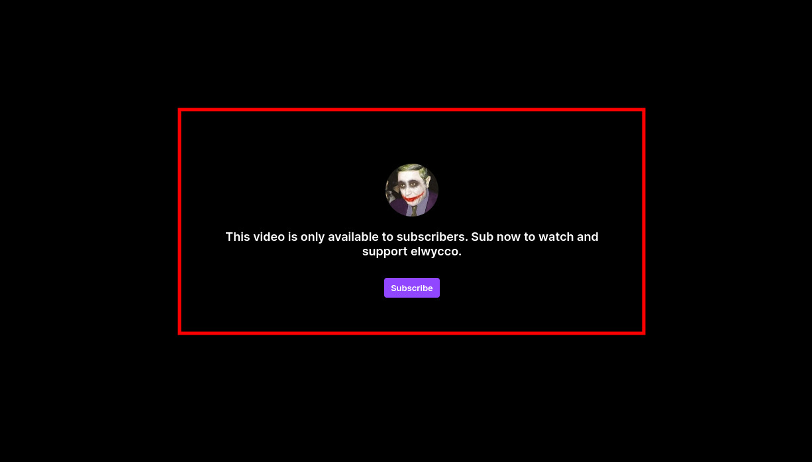
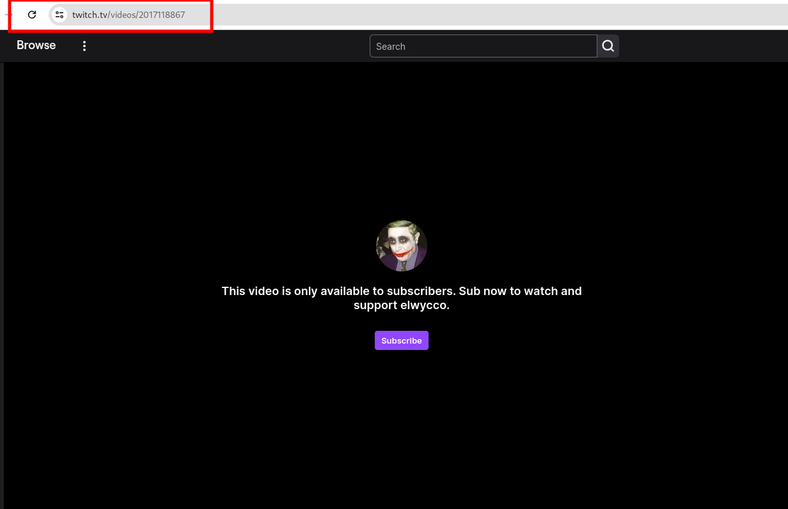
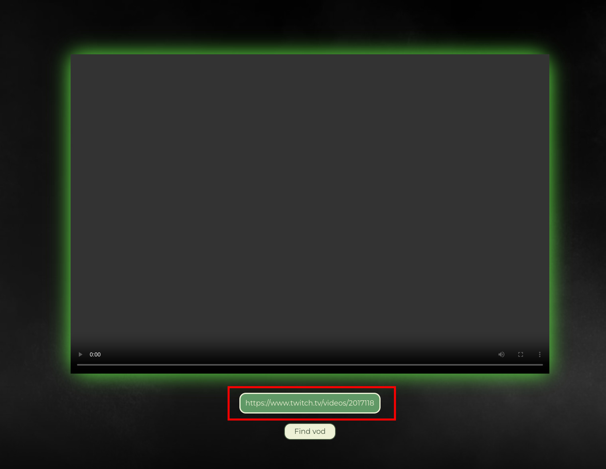
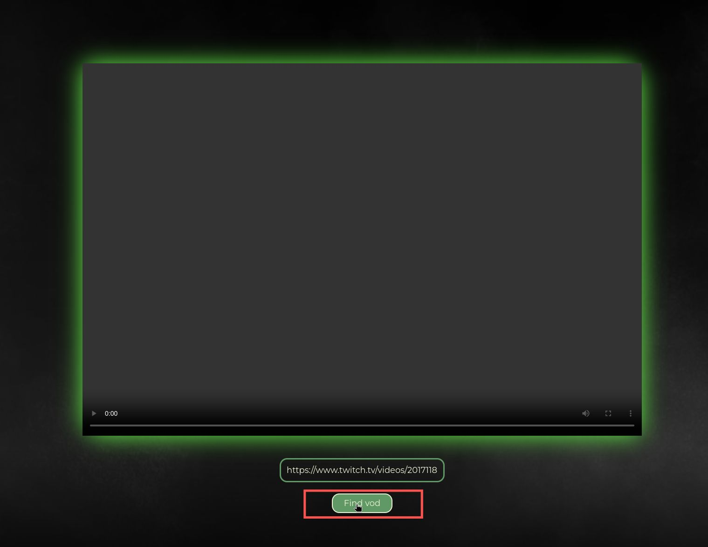
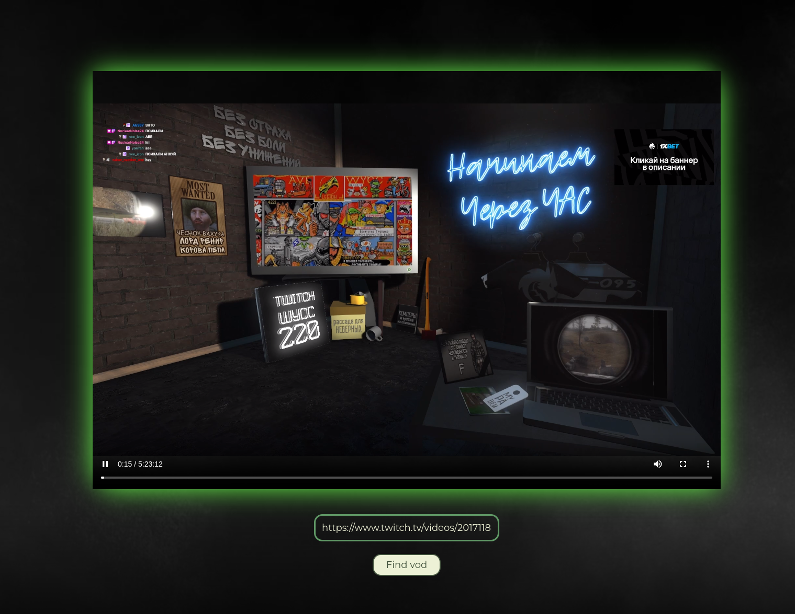

# Twitch Sub Vod Resolver

Be able to watch any sub-only Twitch vod

# Deployment

```bash
docker build . -t tsv-resolver && docker run -dp 8080:8080 tsv-resolver
```

# Instruction

1. Pick video only for subscribers.
   

2. Just copy link from search line
   
3. Go to localhost:8080

4. Paste it in input
   

5. Click button "Find vod"
   

6. Watch your favourite streamers without sub
   
